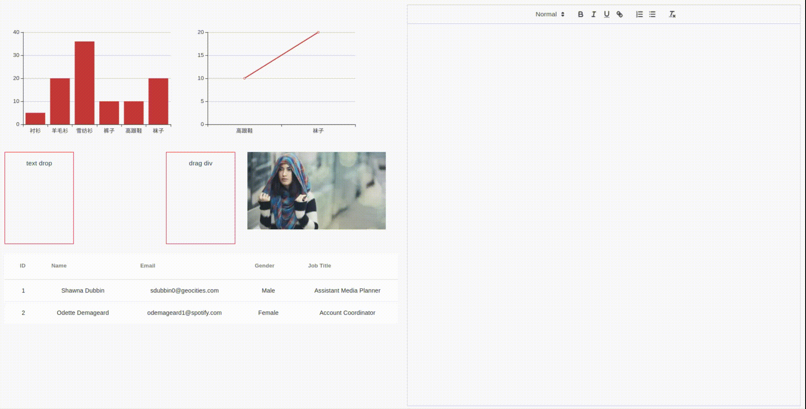

# vue-quill-drag-drop

`vue`  `quill` `drag and drop`  `quill-image-drop-module`

基于 quill 实现了不同类型数据拖拽到富文本输入框. 支持文本拖拽,图片拖拽,canvas 拖拽,表格,html等不同格式数据拖拽.

效果如下:



## Project setup

```
yarn install
```

### Compiles and hot-reloads for development
```
yarn run serve
```

