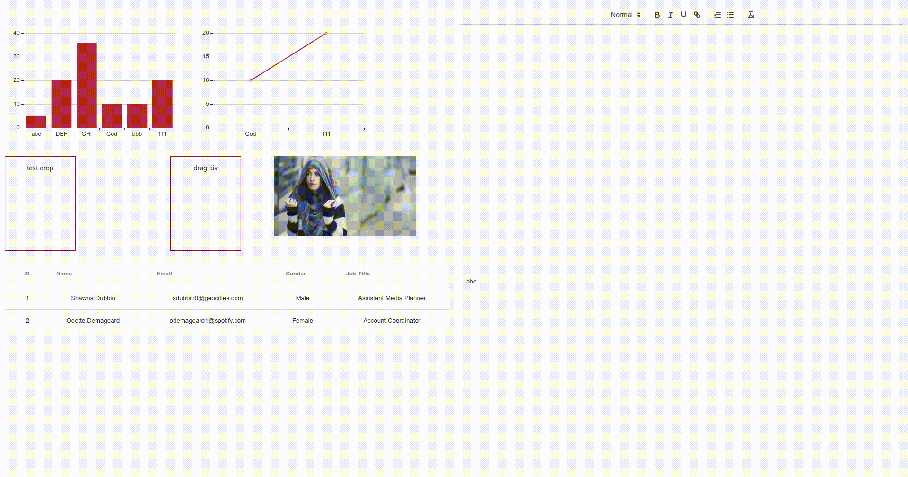

# vue-quill-drag-drop

`vue`  `quill` `drag and drop`  `quill-image-drop-module`

> Based on quill, different types of data are dragged to the rich text input box. It supports text drag, picture drag, canvas drag, table, HTML and other data drag formats.

#### Version

vue: `v2.5.17`

quill: `v1.3.6`

quill-image-drop-module: `v1.0.3`

#### Preview



## Project setup

```
yarn install
```

### Compiles and hot-reloads for development
```
yarn run serve
```

